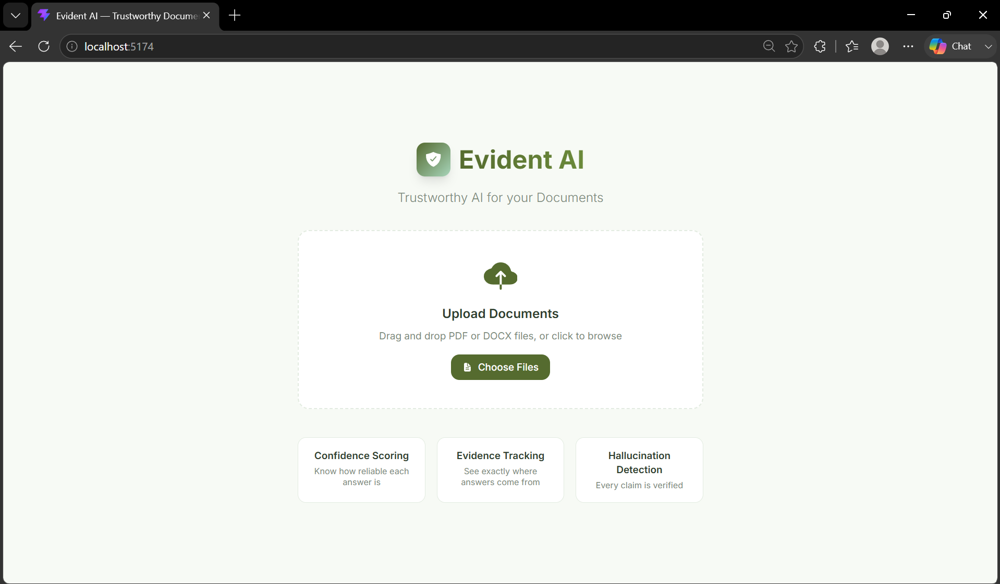
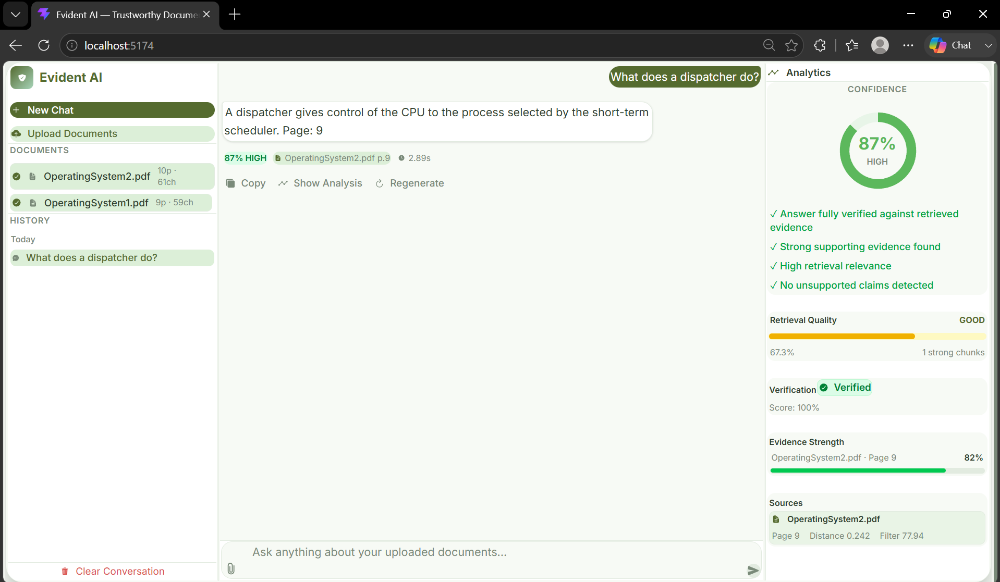
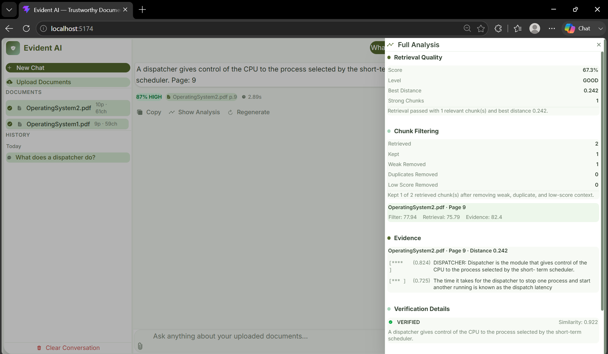

# Evident AI 🛡️
**A Trustworthy Retrieval-Augmented Generation (RAG) System**

Evident AI is a premium, full-stack Document Q&A assistant that provides answers heavily backed by proven evidence. Built with advanced hallucination detection and a dynamic confidence scoring engine, it ensures you can completely trust the information extracted from your PDFs.

---

## 🚀 How to Start the Project

### Prerequisites
- Python 3.10+
- Node.js & npm
- A Hugging Face account (for the API token)

### 1. Setup the Backend
Open your terminal and navigate to the project root:
```bash
# Install Python dependencies
pip install -r requirements.txt

# Create an environment file
echo "HF_TOKEN=your_hugging_face_token_here" > .env

# Start the Flask server (runs on port 5000)
python src/server.py
```

### 2. Setup the Frontend
Open a *new* terminal window:
```bash
# Navigate to the frontend directory
cd frontend

# Install Node dependencies
npm install

# Start the Vite development server (runs on port 5174)
npm run dev
```

---

## 💻 Tech Stack Used

**Frontend:**
- React (Vite)
- Tailwind CSS
- Framer Motion
- Recharts

**Backend:**
- Python / Flask
- ChromaDB (Persistent Vector Database)
- Embeddings: `BAAI/bge-small-en-v1.5`
- LLM: `meta-llama/Llama-3.1-8B-Instruct`
- PDF Extraction: PyMuPDF (`fitz`), `python-docx`

---

## 🏗️ Project Architecture

```text
rag_project/
|-- .env
|-- requirements.txt
|-- uploads/
|-- chroma_db/
|-- data/
|   |-- documents.json
|
|-- src/
|   |-- config.py                  # Central settings and thresholds
|   |-- parser.py                  # PDF and DOCX text extraction
|   |-- preprocessor.py            # Text cleanup
|   |-- chunker.py                 # Recursive overlapping chunk creation
|   |-- embedder.py                # Embedding generation
|   |-- vectordb.py                # Persistent ChromaDB storage
|   |-- document_registry.py       # File hash registry for change detection
|   |-- indexer.py                 # Document indexing pipeline
|   |-- retriever.py               # Adaptive vector retrieval
|   |-- keyword_retriever.py       # BM25 keyword search
|   |-- hybrid_retriever.py        # Blended vector + BM25 hybrid search
|   |-- retrieval_gate.py          # Retrieval quality gate
|   |-- chunk_filter.py            # Chunk scoring, deduplication, and pruning
|   |-- sentence_extractor.py      # Sentence-level evidence extraction
|   |-- prompt.py                  # Grounded prompt construction
|   |-- generator.py               # HuggingFace LLM call
|   |-- hallucination_detector.py  # Answer sentence verification
|   |-- confidence.py              # Confidence scoring
|   |-- evidence.py                # Evidence package builder
|   |-- audit.py                   # Claim-to-evidence audit trail
|   |-- rag.py                     # Complete RAG pipeline
|   |-- rebuild.py                 # Collection rebuild utility logic
|   |-- rebuild_collection.py      # Interactive DB rebuild CLI
|   |-- server.py                  # Flask API Entry point
|   |-- main.py                    # CLI entry point
|
|-- tests/
|
|-- frontend/
|   |-- package.json               # Node.js dependencies
|   |-- vite.config.js             # Vite bundler configuration
|   |-- src/
|       |-- App.jsx                # Main React layout and state
|       |-- index.css              # Global styling and Tailwind config
|       |-- hooks/                 # Custom React hooks (useChat, useDocuments)
|       |-- services/              # Backend API communication layer
|       |-- components/            # UI components (Chat, Analysis, Sidebar, etc.)
```

---

## 🔄 End-to-End Pipeline

```text
User document
    |
    v
PDF/DOCX parser
    |
    v
Text cleaning and recursive chunking
    |
    v
Embedding generation
    |
    v
Persistent ChromaDB storage
    |
    v
User question
    |
    v
Adaptive retrieval
    |
    v
Retrieval quality gate
    |
    v
Chunk filtering and sentence evidence extraction
    |
    v
Grounded LLM generation
    |
    v
Hallucination verification
    |
    v
Confidence score and audit trail
    |
    v
Final answer with sources
```

---

## ✨ Advanced Features

**1. Adaptive Retrieval Depth**
Dynamically changes the number of retrieved document chunks (2 to 8) based on the length and complexity of your question, ensuring optimal context without clutter.

**2. Retrieval Quality Gate Before Generation**
Evaluates the mathematical distance of retrieved chunks. If the system cannot find highly relevant context, it halts generation, preventing the LLM from hallucinating answers.

**3. Safe Empty Response for Missing Information**
Instead of guessing, the system employs a rigid fallback mechanism, safely replying "information not found" when retrieval fails or documents lack the answer.

**4. Intelligent Chunk Filtering After Retrieval**
Re-ranks and sanitizes retrieved chunks to discard duplicates and weak context, ensuring the LLM only reads the absolute best data.

**5. Sentence-Level Evidence Extraction**
Breaks down chunks into precise sentences and ranks them. Instead of dumping a whole paragraph, the system pinpoints the exact sentence that holds the answer.

**6. Hallucination Detection Through Answer Verification**
Acts as a post-generation auditor. It splits the AI's final answer into sentences and mathematically verifies each one against the source text to detect fabricated claims.

**7. Multi-Factor Confidence Scoring**
Generates a highly accurate Confidence Score (`0-100%`) using the following formula:
`Confidence = (Verification * 0.40) + (Best Match * 0.25) + (Evidence Strength * 0.15) + (Supported Claims * 0.10) + (Retrieval Quality * 0.10)`
*(Penalties are heavily applied for detected hallucinations or weak initial retrieval).*

**8. Claim-to-Evidence Audit Trail**
Explains its work by mapping every single generated claim directly back to the specific source document and page number that proves it.

**9. Source and Page Metadata Tracking**
Attaches exact file source and page number metadata strictly to every vector, ensuring citation-style answers can be reliably generated.

**10. Hash-Based Document Change Detection**
Calculates SHA-256 hashes of uploaded files. Avoids wasting time and resources by only re-indexing files that have actually been modified.

**11. Persistent ChromaDB Vector Store**
Acts as a true knowledge base. Vectors are saved locally and persistently across sessions without needing to re-process PDFs on every startup.

**12. Rebuild and Legacy Metadata Checks**
Includes developer CLI tools for inspecting the vector database health, safely wiping it, and performing clean rebuilds.

**13. Strict Grounded Prompting**
Employs zero-temperature settings and strict prompt engineering rules to bind the LLM entirely to the provided context, completely restricting outside knowledge.

**14. Multi-Format Ingestion**
Flexibly handles data by utilizing PyMuPDF for PDFs and python-docx for Word files, standardizing both into a unified format for chunking.

**15. Recursive Overlapping Chunking**
Uses intelligent splitting strategies (by paragraph, sentence, then word) with overlap, preserving contextual meaning much better than basic text slicing.

---

## 📸 Screenshots

- **Main Chat Interface:**







---

Created by **Monishkumar Balaji**

---

## 📄 License
This project is licensed under the MIT License.
